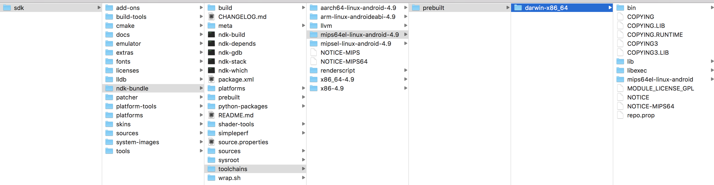

## 1. ndk error
在使用SDK Manager重新安装NDK会一直报错，通过AS无法解决该问题，是因为Google已经开始放弃NDK，因此在AS 3.0以后的NDK包需要自己手动下载。从NDK下载页面下载 android-ndk-r16b-darwin-x86_64.zip文件，下载地址为[NDK Downloads](https://developer.android.google.cn/ndk/downloads/);并找到toolchains/mips64el-linux-android-4.9/prebuilt/darwin-x86_64/，将它复制到NDK文件夹，错误消失。
NDK 覆盖路径如下：

