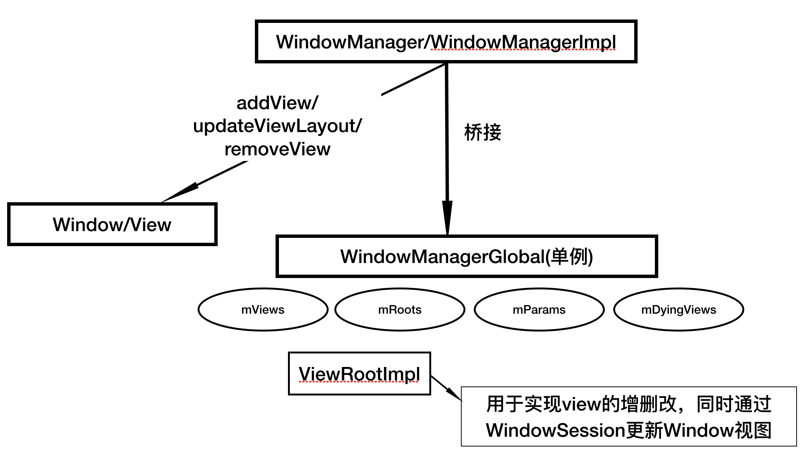

#### [Android开发艺术探索] 理解Window和WindowManager

#### 1. 内部机制
android window是一个抽象的概念，window和view通过ViewRootImpl来建立联系，因此window并不是实际存在的，window是以view的形式存在的。对window的访问必须通过WindowManager。

下图是window增删改view的调用逻辑关系

#### 2. Window创建过程
