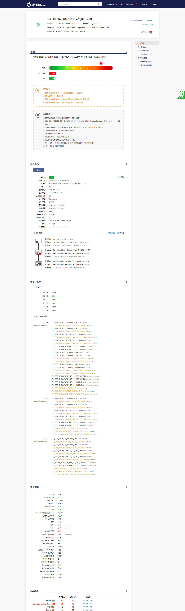

## 解决Symantec证书在Android或者手机版Chrome不信任的问题
背景：

1. 有些浏览器不接受那些众所周知的证书认证机构签署的证书，而另外一些浏览器却接受它们。这是由
于证书签发使用了一些中间认证机构，这些中间机构被众所周知的证书认证机构授权代为签发证书，
但是它们自己却不被广泛认知，所以有些客户端不予识别。针对这种情况，证书认证机构提供一个证
书链的包裹，用来声明众所周知的认证机构和自己的关系，需要将这个证书链包裹与服务器证书合并
成一个文件。

2. 由于Google计划在2018年10月23号后发布的Chrome版本中，不再信任Symantec原PKI系统签发的证书。

在通过域名访问时，会出现提示不受信任，电脑端会弹出添加例外等现象。通过[https://myssl.com](https://myssl.com)进行检测域名时出现提示证书链不完整。如下图所示：


解决措施为在证书校验时添加中间链证书，这样myssl检测还是会出现中间链不完整，但是浏览器因为能拿到中间证书，就不会要求浏览器添加例外了。

首先找到Symantec的证书链包裹，文件名为 SymantecSHA256Chain.cer，可以联系庞晓东获取。
其次将证书链添加到server.cer中。
非常重要的一点是，执行cat命令时，自己的证书一定要放在 SymantecSHA256Chain.cer的前面，否则上传到服务器后会出现密钥验证错误。
形成的结果如下图所示：
<p>
-----BEGIN CERTIFICATE-----  
MIIFCzCCA/OgAwIBAgIQcb4FwsiFd9Yjz2AfX9VaITANBgkqhkiG9w0BAQsFADCB  
hDELMAkGA1UEBhMCVVMxHTAbBgNVBAoTFFN5bWFudGVjIENvcnBvcmF0aW9uMR8w  
HQYDVQQLExZTeW1hbnRlYyBUcnVzdCBOZXR3b3JrMTUwMwYDVQQDEyxTeW1hbnRl  
YyBDbGFzcyAzIFNlY3VyZSBTZXJ2ZXIgU0hBMjU2IFNTTCBDQTAeFw0xNjA0MTMw  
MDAwMDBaFw0xOTA0MTQyMzU5NTlaMIGOMQswCQYDVQQGEwJDTjERMA8GA1UECAwI  
U2hhbmdoYWkxETAPBgNVBAcMCFNoYW5naGFpMSUwIwYDVQQKDBxTQUlDIEdlbmVy  
YWwgTW90b3JzIENvLixMdGQuMREwDwYDVQQLDAhJVCBEZXB0LjEfMB0GA1UEAwwW  
Y2FyZW1vcmVxYS5zYWljLWdtLmNvbTCCASIwDQYJKoZIhvcNAQEBBQADggEPADCC  
AQoCggEBAMR7WQFu6FFwcx+IKv8/rEb2Exw03ZCIgMCwfKlOHTp0oW0QudHxC/ym  
084GXY0wOUw9Zr1TL58FTby1dnbcjbGllYDe83SZRv51ny2HL9PN4yapWIPI6VFx  
DPB7ctTZ3Z2h+DISv5OdDI5wDHkqhJG6DtQGV1ZPpJSyffK4i3xqEmcUMXgKA5Qn  
ks7SO/xU6imfqbzL8ghK5fpk0TgsFPeLP5PXal+0BJmBEMhCZrmlXDh/Xqll/H1c  
I8x0VYwBPNs/vhPpMfTPFrCWS7GjCiwQ66hnKMRloeIimxmj1jVUfgyaNsRsgVhU  
FBiimlgoG/sEBg5XWKbojFLjfjEVZKsCAwEAAaOCAWswggFnMCEGA1UdEQQaMBiC  
FmNhcmVtb3JlcWEuc2FpYy1nbS5jb20wCQYDVR0TBAIwADAOBgNVHQ8BAf8EBAMC  
BaAwHQYDVR0lBBYwFAYIKwYBBQUHAwEGCCsGAQUFBwMCMGEGA1UdIARaMFgwVgYG  
Z4EMAQICMEwwIwYIKwYBBQUHAgEWF2h0dHBzOi8vZC5zeW1jYi5jb20vY3BzMCUG  
CCsGAQUFBwICMBkMF2h0dHBzOi8vZC5zeW1jYi5jb20vcnBhMB8GA1UdIwQYMBaA  
FNtiIPt9Aol80jtvx+QybAVSHa2xMCsGA1UdHwQkMCIwIKAeoByGGmh0dHA6Ly9z  
Zy5zeW1jYi5jb20vc2cuY3JsMFcGCCsGAQUFBwEBBEswSTAfBggrBgEFBQcwAYYT  
aHR0cDovL3NnLnN5bWNkLmNvbTAmBggrBgEFBQcwAoYaaHR0cDovL3NnLnN5bWNi  
LmNvbS9zZy5jcnQwDQYJKoZIhvcNAQELBQADggEBALoT/kMZBtVcEKjJikKTyPM9  
V3EQ8um0XTasksDlq9OJISSGwb/jTj1PWiFeG0uBQcKql7hD4vABhWe/07VpEWrr  
5bmHrKcHS6DpExKmA+ixu4Rk8DFuF/HWDpaEPf6RNZnwnTKrCA+gKRPUEdloYwCF  
0H4ri6eJ/xbWox2oZt0g4hcdWjeg3TV+IhgiW89a+94WsvCzKJQgL11NAgSX/MkI  
uJtC66SG2qr0xksWU8IeImzWwsZ92ZZZ+Fx29CwPdyrcwT8qyPnx0/HQz914Ig11  
a4Iwez3Df690xLWy4B6p1KcAuz4bNhDNH+Sf1qKaidpx3v28RWN0a1g5vjLgc/Q=  
-----END CERTIFICATE-----  
-----BEGIN CERTIFICATE-----  
MIIFSTCCBDGgAwIBAgIQaYeUGdnjYnB0nbvlncZoXjANBgkqhkiG9w0BAQsFADCB  
vTELMAkGA1UEBhMCVVMxFzAVBgNVBAoTDlZlcmlTaWduLCBJbmMuMR8wHQYDVQQL  
ExZWZXJpU2lnbiBUcnVzdCBOZXR3b3JrMTowOAYDVQQLEzEoYykgMjAwOCBWZXJp  
U2lnbiwgSW5jLiAtIEZvciBhdXRob3JpemVkIHVzZSBvbmx5MTgwNgYDVQQDEy9W  
ZXJpU2lnbiBVbml2ZXJzYWwgUm9vdCBDZXJ0aWZpY2F0aW9uIEF1dGhvcml0eTAe  
Fw0xMzA0MDkwMDAwMDBaFw0yMzA0MDgyMzU5NTlaMIGEMQswCQYDVQQGEwJVUzEd  
MBsGA1UEChMUU3ltYW50ZWMgQ29ycG9yYXRpb24xHzAdBgNVBAsTFlN5bWFudGVj  
IFRydXN0IE5ldHdvcmsxNTAzBgNVBAMTLFN5bWFudGVjIENsYXNzIDMgU2VjdXJl  
IFNlcnZlciBTSEEyNTYgU1NMIENBMIIBIjANBgkqhkiG9w0BAQEFAAOCAQ8AMIIB  
CgKCAQEAvjgWUYuA2+oOTezoP1zEfKJd7TuvpdaeEDUs48XlqN6Mhhcm5t4LUUos  
0PvRFFpy98nduIMcxkaMMSWRDlkXo9ATjJLBr4FUTrxiAp6qpxpX2MqmmXpwVk+Y  
By5LltBMOVO5YS87dnyOBZ6ZRNEDVHcpK1YqqmHkhC8SFTy914roCR5W8bUUrIqE  
zq54omAKU34TTBpAcA5SWf9aaC5MRhM7OQmCeAI1SSAIgrOxbIkPbh41JbAsJIPj  
xVAsukaQRYcNcv9dETjFkXbFLPsFKoKVoVlj49AmWM1nVjq633zS0jvY3hp6d+QM  
jAvrK8IisL1Vutm5VdEiesYCTj/DNQIDAQABo4IBejCCAXYwEgYDVR0TAQH/BAgw  
BgEB/wIBADA+BgNVHR8ENzA1MDOgMaAvhi1odHRwOi8vY3JsLndzLnN5bWFudGVj  
LmNvbS91bml2ZXJzYWwtcm9vdC5jcmwwDgYDVR0PAQH/BAQDAgEGMDcGCCsGAQUF  
BwEBBCswKTAnBggrBgEFBQcwAYYbaHR0cDovL29jc3Aud3Muc3ltYW50ZWMuY29t  
MGsGA1UdIARkMGIwYAYKYIZIAYb4RQEHNjBSMCYGCCsGAQUFBwIBFhpodHRwOi8v  
d3d3LnN5bWF1dGguY29tL2NwczAoBggrBgEFBQcCAjAcGhpodHRwOi8vd3d3LnN5  
bWF1dGguY29tL3JwYTAqBgNVHREEIzAhpB8wHTEbMBkGA1UEAxMSVmVyaVNpZ25N  
UEtJLTItMzczMB0GA1UdDgQWBBTbYiD7fQKJfNI7b8fkMmwFUh2tsTAfBgNVHSME  
GDAWgBS2d/ppSEefUxLVwuoHMnYH0ZcHGTANBgkqhkiG9w0BAQsFAAOCAQEAGcyV  
4i97SdBIkFP0B7EgRDVwFNVENzHv73DRLUzpLbBTkQFMVOd9m9o6/7fLFK0wD2ka  
KvC8zTXrSNy5h/3PsVr2Bdo8ZOYr5txzXprYDJvSl7Po+oeVU+GZrYjo+rwJTaLE  
ahsoOy3DIRXuFPqdmBDrnz7mJCRfehwFu5oxI1h5TOxtGBlNUR8IYb2RBQxanCb8  
C6UgJb9qGyv3AglyaYMyFMNgW379mjL6tJUOGvk7CaRUR5oMzjKv0SHMf9IG72AO  
Ym9vgRoXncjLKMziX24serTLR3x0aHtIcQKcIwnzWq5fQi5fK1ktUojljQuzqGH5  
S5tV1tqxkju/w5v5LA==  
-----END CERTIFICATE-----  
</p>
需要注意的是，-----END CERTIFICATE-----和-----BEGIN CERTIFICATE-----需要换行。  
最后重启nginx服务即可。

```sudo nginx -s stop```

```sudo nginx -t```

```sudo nginx```